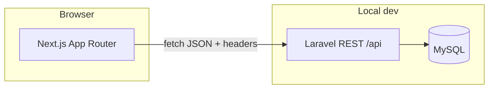

# E‑commerce shopping cart (single-page SPA)

**Next.js (TypeScript)** frontend, **Laravel (PHP)** REST API, and **MySQL** persistence (SQLite remains optional via `.env`). The storefront and cart update on one page via `fetch` without full page reloads.

## How to run locally

### Prerequisites

| Component | Notes |
|-----------|--------|
| PHP | 8.2+ with [Composer](https://getcomposer.org/) |
| Node.js | 20+ with npm |
| Database | **MySQL** (create empty DB first); **SQLite** optional if you uncomment it in `backend/.env` |

### Suggested workflow (two terminals)

1. **Start the Laravel API first**, then the Next.js app. The browser talks to the API using `NEXT_PUBLIC_API_URL`.
2. On first setup, run `composer install` and `npm install`, create `.env` / `.env.local`, and run migrations (commands below).

### Commands

**Terminal A — Laravel (`backend/`)**

```bash
cd backend
composer install
cp .env.example .env
php artisan key:generate
```

Create an empty MySQL database (name must match `DB_DATABASE` in `.env`, default `studio_supply`), set `DB_USERNAME` / `DB_PASSWORD` in `backend/.env`, then:

```bash
php artisan migrate:fresh --seed
php artisan serve
# API default: http://127.0.0.1:8000
```

**Terminal B — Next.js (`frontend/`)**

```bash
cd frontend
npm install
cp .env.local.example .env.local
# If the API is not on port 8000, set NEXT_PUBLIC_API_URL in .env.local
npm run dev
# Open http://localhost:3000
```

### Smoke test

- Home: product grid and cart sidebar; adding items works; **Checkout** as a guest prompts you to log in.
- After **Register** / **Log in**: use **Account** for profile and default shipping; **Checkout** requires a full shipping address before placing the order.

### Laravel admin (Blade back office)

Session-based UI on the same app as the API (separate from the Next.js storefront):

- **Assets:** If you have not run Vite in `backend/`, admin pages still load using the Tailwind CDN. For offline/local built CSS, from `backend/` run `npm install` once, then `npm run build` (creates `public/build/`).
- **URL:** `http://127.0.0.1:8000/admin/login` (or `/admin` after login).
- **Access:** only users with `is_admin = true` (see migration `add_is_admin_to_users_table`).
- **Demo account** (created by `AdminUserSeeder` when you run `--seed`): **email** `admin@example.com`, **password** `password` — change in production.
- **Features:** dashboard counts; **Users** (list, edit, admin flag, optional password reset, delete with safeguards); **Products** (full CRUD; delete blocked if the product appears on non-cart orders); **Orders** (list + detail with line items and shipping snapshot).

The SPA uses **Sanctum API tokens**; the admin uses the **`web` guard** and cookies. The same database user can use both: after you log in to the shop as an admin, the app calls **`POST /api/admin/web-session`** (with `credentials: "include"`) to create a matching session so **Admin panel** opens logged in.

If cookie sync fails (wrong CORS origin), you can still sign in at `/admin/login` with the same email and password.

### Troubleshooting

| Issue | What to check |
|-------|----------------|
| Frontend cannot reach the API | Terminal A is running `php artisan serve`, and `frontend/.env.local` has `NEXT_PUBLIC_API_URL` matching the API (e.g. `http://127.0.0.1:8000`). |
| Missing tables | From `backend/`, run `php artisan migrate` or `php artisan migrate:fresh --seed` (the latter wipes the DB). |
| MySQL connection refused / access denied | MySQL is running, database exists, and `DB_HOST`, `DB_DATABASE`, `DB_USERNAME`, `DB_PASSWORD` in `backend/.env` are correct. |
| Using SQLite instead | In `backend/.env`, set `DB_CONNECTION=sqlite` and `DB_DATABASE` to your `.sqlite` file path (see `.env.example` comments). |
| Admin panel asks for login after SPA login | The shop uses API tokens; admin uses cookies. They share the same `users` rows, but the SPA calls `POST /api/admin/web-session` to create a `web` session. Ensure `backend/.env` has `CORS_ALLOWED_ORIGINS` listing the **exact** origin you use for Next.js (e.g. `http://localhost:3000`). Avoid mixing `localhost` vs `127.0.0.1` for the shop and API unless both are listed. |

---

## Architecture

### System overview (decoupled SPA + API)



- **Frontend:** SPA-style navigation (App Router). Cart state is synced with `fetch` using an **`X-Cart-Token`** header. After login, protected routes use a **Bearer token** stored in `localStorage`.
- **Backend:** Laravel exposes JSON only (`routes/api.php`); it does not render Next.js pages. Auth uses **Sanctum personal access tokens**.
- **Cart implementation:** REST paths are `/api/cart/...`, but persistence is **`orders`** (draft `status = cart`) plus **`order_items`**, not a separate `carts` table.

### Repository layout (main areas)

```
project-root/
├── frontend/                 # Next.js (TypeScript)
│   ├── app/                  # Routes: /, /products/[id], /login, /register, /account, /checkout
│   ├── components/           # e.g. ShopHeader, CartPanel
│   ├── contexts/             # auth-context (token / user)
│   ├── hooks/                # useCart — keeps cart in sync with the API
│   └── lib/                  # api.ts, authApi.ts, profileApi.ts, types, money
├── backend/                  # Laravel API + Blade admin under /admin
│   ├── routes/api.php        # All /api routes and middleware groups
│   ├── routes/web.php       
│   ├── app/Http/Controllers/Api/
│   ├── app/Http/Controllers/Admin/
│   │   # Auth, Profile, Product, Cart*, Checkout
│   ├── app/Models/           # User, Product, Order, OrderItem
│   └── database/migrations/  # users, products, orders, order_items, tokens, …
├── database/                 # database_export.sql (demo DB dump), products_seed.json
└── README.md
```

### Requests and auth (mental model)

| Piece | Where it lives | Purpose |
|-------|----------------|---------|
| `X-Cart-Token` (UUID) | Browser `localStorage` | Identifies one draft order / cart |
| `Authorization: Bearer …` | `localStorage` | Used after login for attach, profile, checkout, etc. |

Guests can add to cart with only the cart token. After **`/api/cart/attach`** links the order to a user, cart APIs typically require that user’s Bearer token or the API returns **403**.

---

## Authentication (Laravel Sanctum + SPA token)

| Endpoint | Notes |
|----------|--------|
| `POST /api/register` | JSON: `name`, `email`, `password`, `password_confirmation` (min 8). Returns `user` + `token`. |
| `POST /api/login` | JSON: `email`, `password`. Returns `user` + `token` (previous tokens for that user are revoked). |
| `POST /api/logout` | Requires `Authorization: Bearer <token>`. |
| `GET /api/user` | Current user profile; requires Bearer token. |
| `POST /api/cart/attach` | Requires Bearer + `X-Cart-Token` — links a guest draft order to the logged-in user (`orders.user_id`). |

The Next.js app stores the **API token** in `localStorage` and sends it on cart and checkout requests. New carts created while logged in get `user_id` set automatically. **Guest orders** (`user_id` null) stay addressable by cart token only; once linked, the same order requires the matching account’s Bearer token for cart/checkout APIs (403 otherwise).

**Checkout** requires a logged-in user (`POST /api/checkout` is behind `auth:sanctum`). The checkout form collects **shipping address** (`shipping_*` JSON fields); values can be saved to the user profile when `save_to_profile` is true. **Profile** (`GET` / `PATCH /api/profile`) stores optional `phone` and default shipping fields on `users` for pre-filling checkout.

**UI:** `/login`, `/register`, `/account` (personal + default shipping + password), header shows the **user menu** (account, admin link when `is_admin`, log out) when authenticated. Cart sidebar uses **Log in to checkout** for guests (redirects via `?redirect=/checkout` after sign-in).

After cloning, follow **How to run locally** above. Run `composer install` (includes **`laravel/sanctum`**) and migrations before using auth or checkout.

## Data model (catalog vs orders)

Similar to a typical marketplace split (e.g. separate product catalogue and transactional data):

| Table | Role |
|--------|------|
| **`products`** | Product catalogue — name, description, price, image, stock. CRUD here is “admin catalogue” style; the demo seeds sample rows. |
| **`orders`** | Draft carts (`status = cart`) may be guest (`user_id` null) or owned by **`users.id`** after login / attach. **Checkout** sets `pending_payment`, `payment_method`, `placed_at`. |
| **`order_items`** | Lines on an order: `product_id`, `quantity`, and **`unit_price`** (snapshot when the line is first added so line totals stay consistent if catalogue prices change). |

The REST paths are `/api/cart/...`, but persistence is **orders + order_items**, not a separate “cart” table.

## Features mapped to CRUD

| Operation | Implementation |
|-----------|----------------|
| **Create** | `POST /api/cart/items` — add to cart (same cart + same product merges quantity) |
| **Read** | `GET /api/products` — catalogue; `GET /api/cart` — current cart and subtotal |
| **Update** | `PATCH /api/cart/items/{id}` — change line quantity |
| **Delete** | `DELETE /api/cart/items/{id}` — remove a line |
| **Checkout** | `POST /api/checkout` (Bearer + `X-Cart-Token`) — payment method + required shipping snapshot; records payment choice and freezes the order (cart mutations return **409** afterward). |

Guest carts are identified by an `X-Cart-Token` header (UUID). The SPA stores that token in `localStorage`, while **cart lines are persisted in the database** under `orders` / `order_items`. To reopen the same cart after clearing site data or on another device, use the UI **Copy cart link** or open the site with `?cart=<uuid>` (the query param is read once and then removed from the address bar).

**Routes:** `/` — catalogue + cart sidebar; **live catalogue search** (debounced) calls the API with `q` as you type. `/products/[id]` — product detail; `/checkout` — English checkout (ATM / PayID / BPAY placeholders; redirects to login if not authenticated); confirmation screen after **Place order**.

**Admin orders:** the orders list supports a **status** filter (`All` / **Draft carts only** / **Pending payment only**) so tutors can isolate in-progress carts (Assignment 2 “view all users’ shopping carts”).

### SQLite instead of MySQL (optional)

If you prefer a file DB, edit `backend/.env` and follow the commented block in `.env.example` (`DB_CONNECTION=sqlite` + `DB_DATABASE` path). Create the file if needed:

```bash
touch database/database.sqlite
# Set DB_DATABASE in .env to database/database.sqlite or an absolute path
php artisan migrate:fresh --seed
```

PHPUnit still uses an in-memory SQLite database via `phpunit.xml`; that is unchanged.

## Challenges overcome

I have been working as a software engineer for about five years, with most of that time spent designing and building websites, so wiring a decoupled storefront to a REST API and a relational database did not feel technically difficult—the core assignment was close to routine work for my background. The bulk of the effort went into meeting coursework expectations clearly (full CRUD on persisted cart data, SPA-style behaviour with client-side navigation and `fetch` instead of full page reloads for cart actions, and tidy separation between the Next.js app and Laravel) rather than learning fundamentals from scratch. I spent more attention on polish and reproducibility: input validation, sensible API errors instead of silent failures, CORS and Sanctum token behaviour documented for whoever runs the repo, and a readme detailed enough to mark and demo quickly. Compared with typical production pressures such as scaling, compliance, or legacy integrations, the difficulty here was minimal, but packaging a complete vertical slice still made a useful checklist exercise.

## Database export (backup)

A committed snapshot for submission is at **`database/database_export.sql`** (SQLite-format SQL from `php artisan migrate:fresh --seed`, then trimmed to demo-only rows: default admin user plus seeded products). Markers can inspect schema and seed data directly; to load into SQLite, point `DB_DATABASE` at a file and run `sqlite3 your.db < database/database_export.sql` (or import via your SQL client).

To snapshot your own environment (e.g. MySQL in production):

- **MySQL**: `mysqldump -u USER -p studio_supply > database_export.sql`
- **SQLite**: `sqlite3 backend/database/database.sqlite .dump > database_export.sql`

`database/products_seed.json` lists the seeded products for reference or manual import.

## API reference

| Method | Path | Notes |
|--------|------|--------|
| GET | `/api/products` | All products; optional query `q` (max 120 chars) filters by name or description (substring match) |
| GET | `/api/products/{id}` | One product (`404` if missing) |
| POST | `/api/cart/sessions` | Create a cart session; returns `token` |
| GET | `/api/cart` | `X-Cart-Token` (+ Bearer if order is linked to a user) |
| POST | `/api/register` | Create account |
| POST | `/api/login` | Issue token |
| POST | `/api/logout` | Bearer required |
| GET | `/api/user` | Bearer required |
| GET | `/api/profile` | Bearer — `avatar_url`, `phone`, `shipping_*` defaults |
| PATCH | `/api/profile` | Bearer — optional `avatar_url`, `phone`, `shipping_*` |
| POST | `/api/admin/web-session` | Bearer; **`is_admin` only** — creates `web` session cookie for `/admin` |
| DELETE | `/api/admin/web-session` | Bearer — clears that `web` session (SPA logout) |
| POST | `/api/cart/attach` | Bearer + `X-Cart-Token` |
| POST | `/api/cart/items` | JSON `{ "product_id", "quantity" }` + `X-Cart-Token` |
| PATCH | `/api/cart/items/{id}` | JSON `{ "quantity" }` |
| DELETE | `/api/cart/items/{id}` | Remove line |
| POST | `/api/checkout` | Bearer + `X-Cart-Token`. Body: `payment_method`, required `shipping_recipient_name`, `shipping_phone`, `shipping_line1`, `shipping_city`, `shipping_state`, `shipping_postcode`, `shipping_country`; optional `shipping_line2`, `save_to_profile` (bool) |

CORS in `backend/config/cors.php` uses `supports_credentials` and `CORS_ALLOWED_ORIGINS` so the SPA can receive the admin session cookie; add your production storefront origin before deploying.
