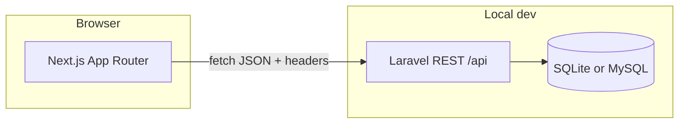

# Assignment 1 — E‑commerce shopping cart (single-page SPA)

**Next.js (TypeScript)** frontend, **Laravel (PHP)** REST API, and **MySQL / SQLite** persistence. The storefront and cart update on one page via `fetch` without full page reloads.

## How to run locally

### Prerequisites

| Component | Notes |
|-----------|--------|
| PHP | 8.2+ with [Composer](https://getcomposer.org/) |
| Node.js | 20+ with npm |
| Database | **SQLite** by default (no server); **MySQL** is optional (e.g. for submission) |

### Suggested workflow (two terminals)

1. **Start the Laravel API first**, then the Next.js app. The browser talks to the API using `NEXT_PUBLIC_API_URL`.
2. On first setup, run `composer install` and `npm install`, create `.env` / `.env.local`, and run migrations (commands below).

### Commands

**Terminal A — Laravel (`backend/`)**

```bash
cd backend
composer install
cp .env.example .env
php artisan key:generate
```

Quick start with SQLite (default `.env` points at `database/database.sqlite`):

```bash
touch database/database.sqlite
php artisan migrate:fresh --seed
php artisan serve
# API default: http://127.0.0.1:8000
```

**Terminal B — Next.js (`frontend/`)**

```bash
cd frontend
npm install
cp .env.local.example .env.local
# If the API is not on port 8000, set NEXT_PUBLIC_API_URL in .env.local
npm run dev
# Open http://localhost:3000
```

### Smoke test

- Home: product grid and cart sidebar; adding items works; **Checkout** as a guest prompts you to log in.
- After **Register** / **Log in**: use **Account** for profile and default shipping; **Checkout** requires a full shipping address before placing the order.

### Troubleshooting

| Issue | What to check |
|-------|----------------|
| Frontend cannot reach the API | Terminal A is running `php artisan serve`, and `frontend/.env.local` has `NEXT_PUBLIC_API_URL` matching the API (e.g. `http://127.0.0.1:8000`). |
| Missing tables | From `backend/`, run `php artisan migrate` or `php artisan migrate:fresh --seed` (the latter wipes the DB). |
| Switching to MySQL | Set `DB_*` in `backend/.env`, create the database, then `php artisan migrate:fresh --seed`. |

---

## Architecture

### System overview (decoupled SPA + API)



- **Frontend:** SPA-style navigation (App Router). Cart state is synced with `fetch` using an **`X-Cart-Token`** header. After login, protected routes use a **Bearer token** stored in `localStorage`.
- **Backend:** Laravel exposes JSON only (`routes/api.php`); it does not render Next.js pages. Auth uses **Sanctum personal access tokens**.
- **Cart implementation:** REST paths are `/api/cart/...`, but persistence is **`orders`** (draft `status = cart`) plus **`order_items`**, not a separate `carts` table.

### Repository layout (main areas)

```
Assignment 1/
├── frontend/                 # Next.js (TypeScript)
│   ├── app/                  # Routes: /, /products/[id], /login, /register, /account, /checkout
│   ├── components/           # e.g. ShopHeader, CartPanel
│   ├── contexts/             # auth-context (token / user)
│   ├── hooks/                # useCart — keeps cart in sync with the API
│   └── lib/                  # api.ts, authApi.ts, profileApi.ts, types, money
├── backend/                  # Laravel API
│   ├── routes/api.php        # All /api routes and middleware groups
│   ├── app/Http/Controllers/Api/
│   │   # Auth, Profile, Product, Cart*, Checkout
│   ├── app/Models/           # User, Product, Order, OrderItem
│   └── database/migrations/  # users, products, orders, order_items, tokens, …
├── database/                 # e.g. products_seed.json for reference / export
└── README.md
```

### Requests and auth (mental model)

| Piece | Where it lives | Purpose |
|-------|----------------|---------|
| `X-Cart-Token` (UUID) | Browser `localStorage` | Identifies one draft order / cart |
| `Authorization: Bearer …` | `localStorage` | Used after login for attach, profile, checkout, etc. |

Guests can add to cart with only the cart token. After **`/api/cart/attach`** links the order to a user, cart APIs typically require that user’s Bearer token or the API returns **403**.

---

## Authentication (Laravel Sanctum + SPA token)

| Endpoint | Notes |
|----------|--------|
| `POST /api/register` | JSON: `name`, `email`, `password`, `password_confirmation` (min 8). Returns `user` + `token`. |
| `POST /api/login` | JSON: `email`, `password`. Returns `user` + `token` (previous tokens for that user are revoked). |
| `POST /api/logout` | Requires `Authorization: Bearer <token>`. |
| `GET /api/user` | Current user profile; requires Bearer token. |
| `POST /api/cart/attach` | Requires Bearer + `X-Cart-Token` — links a guest draft order to the logged-in user (`orders.user_id`). |

The Next.js app stores the **API token** in `localStorage` and sends it on cart and checkout requests. New carts created while logged in get `user_id` set automatically. **Guest orders** (`user_id` null) stay addressable by cart token only; once linked, the same order requires the matching account’s Bearer token for cart/checkout APIs (403 otherwise).

**Checkout** requires a logged-in user (`POST /api/checkout` is behind `auth:sanctum`). The checkout form collects **shipping address** (`shipping_*` JSON fields); values can be saved to the user profile when `save_to_profile` is true. **Profile** (`GET` / `PATCH /api/profile`) stores optional `phone` and default shipping fields on `users` for pre-filling checkout.

**UI:** `/login`, `/register`, `/account` (personal + default shipping), header shows **Account** and **Log out** when authenticated. Cart sidebar uses **Log in to checkout** for guests (redirects via `?redirect=/checkout` after sign-in).

After cloning, follow **How to run locally** above. Run `composer install` (includes **`laravel/sanctum`**) and migrations before using auth or checkout.

## Data model (catalog vs orders)

Similar to a typical marketplace split (e.g. separate product catalogue and transactional data):

| Table | Role |
|--------|------|
| **`products`** | Product catalogue — name, description, price, image, stock. CRUD here is “admin catalogue” style; the demo seeds sample rows. |
| **`orders`** | Draft carts (`status = cart`) may be guest (`user_id` null) or owned by **`users.id`** after login / attach. **Checkout** sets `pending_payment`, `payment_method`, `placed_at`. |
| **`order_items`** | Lines on an order: `product_id`, `quantity`, and **`unit_price`** (snapshot when the line is first added so line totals stay consistent if catalogue prices change). |

The REST URLs still say `/api/cart/...` for the assignment SPA, but persistence is **orders + order_items**, not a separate “cart” table.

## Features mapped to CRUD

| Operation | Implementation |
|-----------|----------------|
| **Create** | `POST /api/cart/items` — add to cart (same cart + same product merges quantity) |
| **Read** | `GET /api/products` — catalogue; `GET /api/cart` — current cart and subtotal |
| **Update** | `PATCH /api/cart/items/{id}` — change line quantity |
| **Delete** | `DELETE /api/cart/items/{id}` — remove a line |
| **Checkout** | `POST /api/checkout` (Bearer + `X-Cart-Token`) — payment method + required shipping snapshot; records payment choice and freezes the order (cart mutations return **409** afterward). |

Guest carts are identified by an `X-Cart-Token` header (UUID). The SPA stores that token in `localStorage`, while **cart lines are persisted in the database** under `orders` / `order_items`. To reopen the same cart after clearing site data or on another device, use the UI **Copy cart link** or open the site with `?cart=<uuid>` (the query param is read once and then removed from the address bar).

**Routes:** `/` — catalogue + cart sidebar; `/products/[id]` — product detail; `/checkout` — English checkout (ATM / PayID / BPAY placeholders; redirects to login if not authenticated); confirmation screen after **Place order**.

### MySQL instead of SQLite

The quick start uses SQLite. For MySQL, edit `backend/.env`:

```env
DB_CONNECTION=mysql
DB_HOST=127.0.0.1
DB_PORT=3306
DB_DATABASE=assignment1_cart
DB_USERNAME=root
DB_PASSWORD=your_password
```

Create the empty database, then from `backend/`:

```bash
php artisan migrate:fresh --seed
php artisan serve
```

No frontend changes are needed unless the API base URL is no longer `http://127.0.0.1:8000`.

## Submission: database export

After seeding, include one of the following in your submission package:

- **MySQL**: `mysqldump -u USER -p assignment1_cart > database_export.sql`
- **SQLite**: `sqlite3 backend/database/database.sqlite .dump > database_export.sql`

`database/products_seed.json` lists the seeded products for reference or manual import.

## API reference

| Method | Path | Notes |
|--------|------|--------|
| GET | `/api/products` | All products |
| GET | `/api/products/{id}` | One product (`404` if missing) |
| POST | `/api/cart/sessions` | Create a cart session; returns `token` |
| GET | `/api/cart` | `X-Cart-Token` (+ Bearer if order is linked to a user) |
| POST | `/api/register` | Create account |
| POST | `/api/login` | Issue token |
| POST | `/api/logout` | Bearer required |
| GET | `/api/user` | Bearer required |
| GET | `/api/profile` | Bearer — `phone`, `shipping_*` defaults |
| PATCH | `/api/profile` | Bearer — optional `phone`, `shipping_*` |
| POST | `/api/cart/attach` | Bearer + `X-Cart-Token` |
| POST | `/api/cart/items` | JSON `{ "product_id", "quantity" }` + `X-Cart-Token` |
| PATCH | `/api/cart/items/{id}` | JSON `{ "quantity" }` |
| DELETE | `/api/cart/items/{id}` | Remove line |
| POST | `/api/checkout` | Bearer + `X-Cart-Token`. Body: `payment_method`, required `shipping_recipient_name`, `shipping_phone`, `shipping_line1`, `shipping_city`, `shipping_state`, `shipping_postcode`, `shipping_country`; optional `shipping_line2`, `save_to_profile` (bool) |

CORS is permissive in `backend/config/cors.php` for local development; lock it down to your production origin before deploying.

## Academic integrity

This repository is a coursework scaffold. Cite any third-party code or assets as required by your subject outline, and test all features before you submit.
